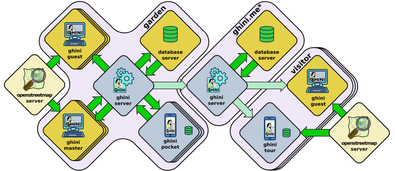

ghini.server
============================

Ghini is a suite of software programs, helping the management and presentation of
botanical data.  It aims at botanical gardens, plant collectors, nurseries, and
their visitors.

This is the central ``ghini.server``, serving data to all other Ghini family
members.  ``ghini.server`` handles data from one garden, or for several.

* in combination with the included ``ghini.web`` client, it lets logged in garden
  conservators plan their work, produce logs, and review their garden history.
* in combination with the ``ghini.web`` web client, it provides non logged in
  visitors a read-only access to portions of the database.
* in combination with ``ghini.pocket``, it lets gardeners streamline their daily
  activities, and make it visible to the garden conservator.
* in combination with ``ghini.tour``, it lets visitors find their way in the
  garden.
* ``ghini.server`` can cooperate with other instances of itself, contributing
  selected data to a ``ghini.server`` instance running as a garden aggregator.
  A ``ghini.web`` client accessing a garden aggregator server will now show data
  from several gardens at the same time.
