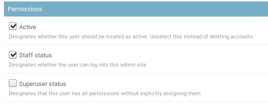
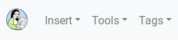
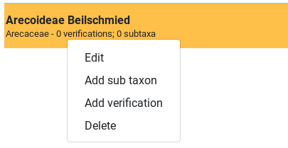
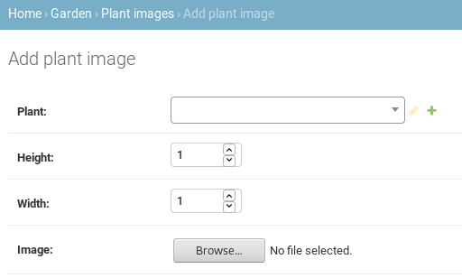
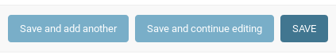
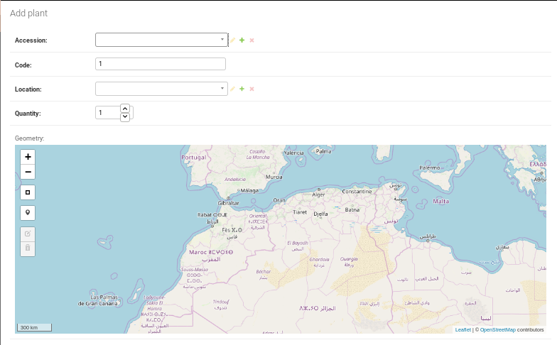
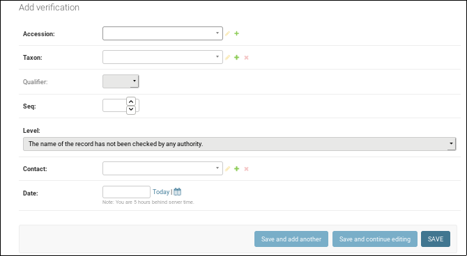
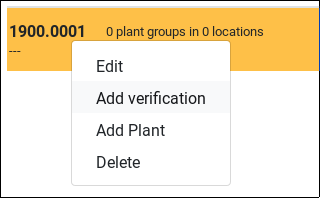

participating
-------------------

This page explains how to contribute data to a running ghini site.

your account
~~~~~~~~~~~~~~~~~~~~~~~~~~~~~~~~~

You need an account for the site, it needs to be enabled, and to make you part of the staff.
You do not need superpowers to contribute data.

When logged in as staff member, you will see the *Insert* menu next to the Ghini icon,
before the *Tools* menu,

moreover, in the Results page, right-clicking on any results row will show the context menu
associated to the row type.

If you do not see these, you are being handled by the software as a visitor, and you need to
logout and log back in with your full permissions.

organize your pictures
~~~~~~~~~~~~~~~~~~~~~~~~~~~~~~~~~

The software requires that you organize your plant images by physical plant, and by
accession.  Please make sure your data follows this order before you start.

A running definition of a database accession for plants photographed in the wild, it is a
group of nearby plants, clearly of the same species and variety, very likely of the same
age, and clearly belonging to the same population.  Decide for yourself if you want to use
the term accession as a synonym for population.

A running definition of a database plant for the same case, that would be a group of plants
within the same accession, difficult to separate from one another.  They all share the same
geographic coordinates, and you can provide a reasonable estimate of the number of
individual plants composing the group.

bulk inserts
~~~~~~~~~~~~~~~~~~~~~~~~~~~~~~~~~

If you have a large amount of accessions that you want to document with plant images, you
may request a bulk insertion.  Please write a friendly email to ``Mario Frasca
<ghini@anche.no>``, stating your needs.  It makes sense if you have more than, say, twenty
accessions.

adding images
~~~~~~~~~~~~~~~~~~~~~~~~~~~~~~~~~

The basic logic is: first have all your accessions in place, which you either do manually,
or with a request for bulk insertion, then navigate to `the URL for adding plant images
<https://almaghreb.ghini.me/admin/garden/plantimage/add/>`_.

You will be presented with this form:

In this form you basically repeat: choose a plant from the database, ignore height and
width, choose a picture from your file system (this will provide the correct values for
height and width), then click on one of the three *Save* buttons:

If you are adding an image for a plant already represented in the database, simply start
typing the plant accession number, and the software will present you the plants matching the
text you are typing.  Each time the image is relative to a new plant, you need to add the
database object that describes the plant in question.  You do so by clicking on the ``+``
button next to the plant chooser widget.

This will open a new window,

Here you choose your **accession**, indicate a numerical sequential value for the plant
**code** within the accession (you need to so manually), select or add a plant **location**
(it would be the name of the area for your observations), provide an estimate of the
**quantity** of individual plants in the plant group, and use the **geometry** map to
indicate an approximate plant position.  You do so by activating the *draw a marker* widget,
then clicking on the approximate spot in the map.  Zoom in or zoom out, and peruse the other
widgets as necessary.

Do not forget to *Save* your changes.

Back to your Plant Image insertion window, browse to your image, confirm by ``save`` or
``save and add another``.

validating
~~~~~~~~~~~~~~~~~~~~~~~~~~~~~~~~~

A different activity is relative to validating accessions with taxonomic information.  You
can do so from `the admin interface
<https://almaghreb.ghini.me/admin/collection/verification/add/>`_,

but you can also use the results window, activating the context menu for the accession you
want to validate.

